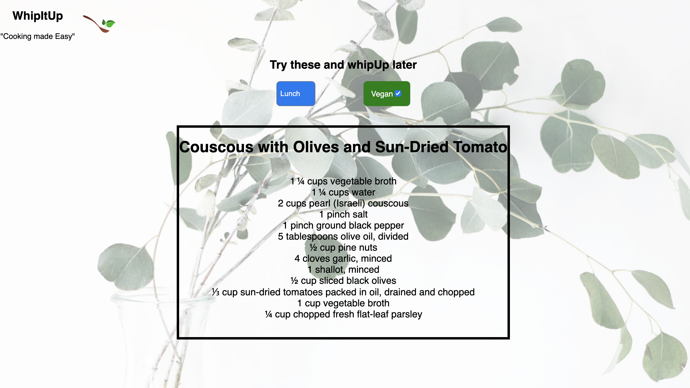
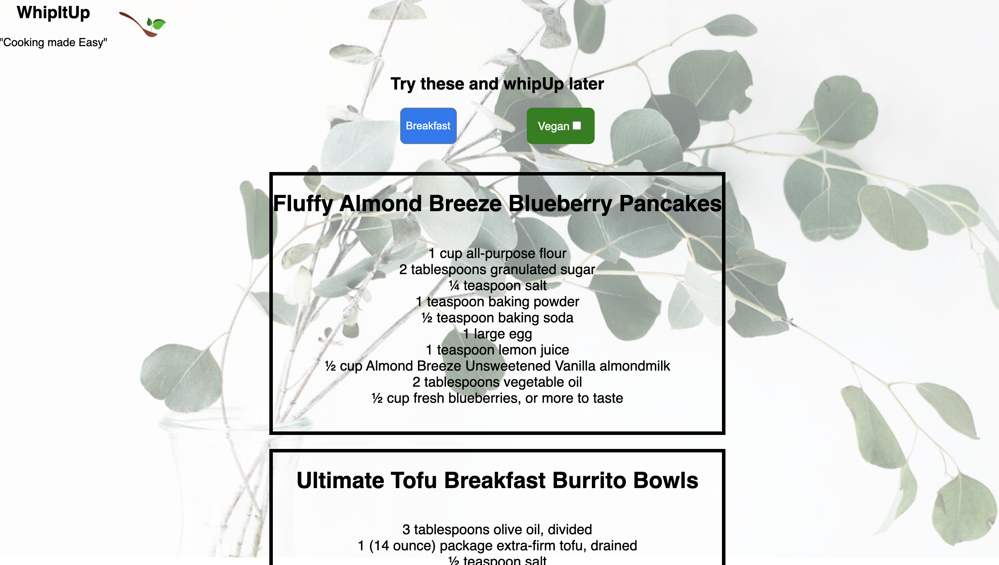
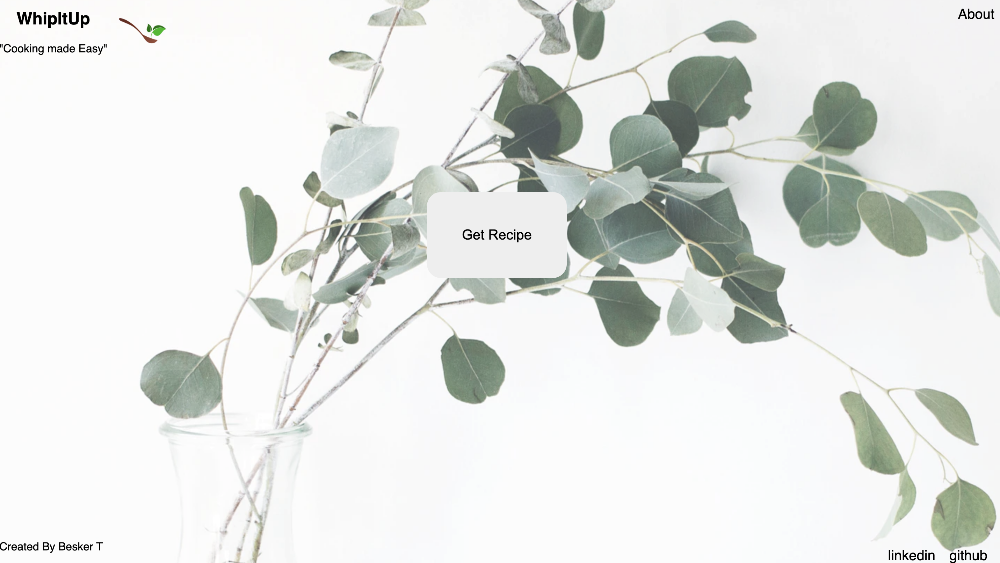
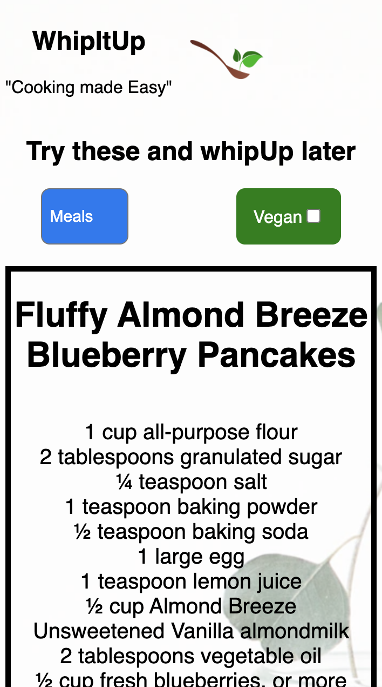
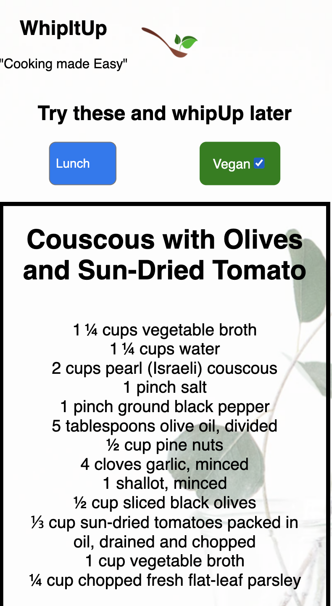

# WhipItUp

[Live App](https://whipitup.besker.vercel.app/)

## Descriptions and Users

whitIpUp is an app that help people cook a bit easier by provide recipes that can be cooked in 45mnts or less.the user will have a list of potential recipes maybe for dinner,lunch or breakfast. the app will return potential recipes based on the filter selections.

## Users

- get recipes
- filter recipes
- get vegan recipes

## View on mobile

# Tech used

- React

- React-router

- CSS3
